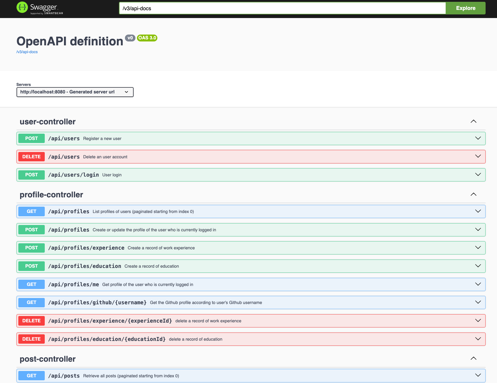

# DevConnector RESTful APIs rewrite in Java
Nothing but practicing my JAVA skills. Course "MERN Stack Front To Back: Full Stack React, Redux & Node.js" originated from [Udemy](https://www.udemy.com/course/mern-stack-front-to-back)
- Spring Boot to bootstrap the project
- Controllers based on SpringMVC
- Spring Security with JWT for authentication 
- JPA + MySQL on the data access layer

 

